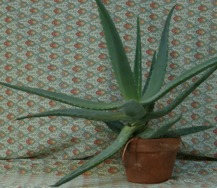
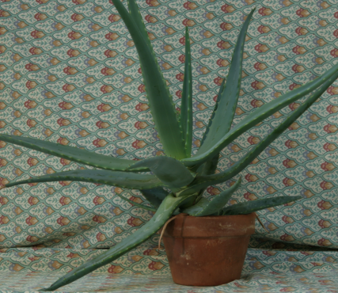
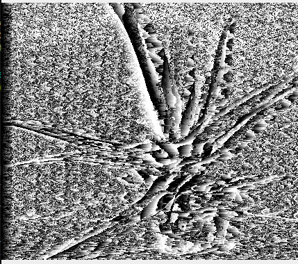
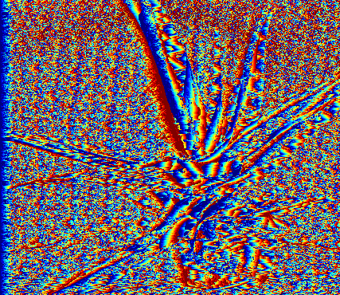
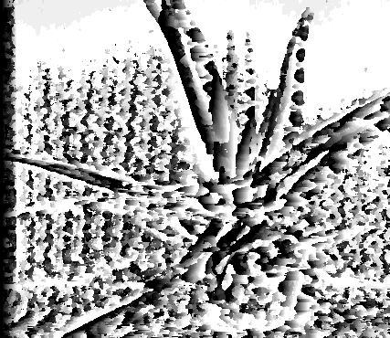
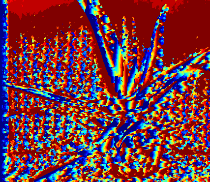
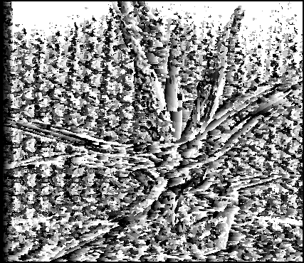
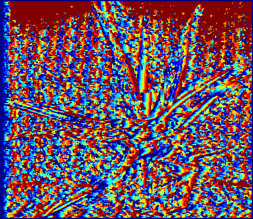

# Depth Information Reconstruction

## Table of Contents

1. [Introduction](#introduction)
2. [Project Structure](#-project-structure)
3. [Installation & Usage](#-installation--usage)
4. [Results & Visualization](#-results--visualization)
5. [Contact](#-contact)

## Introduction
This project aims to reconstruct depth information from a pair of stereo images by computing and visualizing the disparity map. Various image processing methods are applied, including:

- ✅ **Pixel-wise Matching**: Calculates disparity per pixel using L1 (abs error) and L2 (square error) distance metrics.
- ✅ **Window-based Matching**: Uses a window to compare pixel vectors for smoother results.
- ✅ **Cosine Similarity**: Enhances quality by reducing noise with optimized parameters.

## 📂 Project Structure
📂 **Depth-Information-Reconstruction**  
 ├── 📁 **data/**                 # Contains input stereo images  
 ├── 📁 **results/**              # Stores output disparity maps  
 ├── 📜 **main.py**               # Main execution file  
 ├── 📜 **disparity.py**          # Disparity calculation functions  
 ├── 📜 **display.py**            # Visualization and plotting functions  
 ├── 📜 **utils.py**              # Utility functions  
 ├── 📜 **metrics.py**            # Evaluation metrics for disparity maps  
 ├── 📜 **pixel_matching.py**     # Implements pixel-wise disparity matching  
 ├── 📜 **window_matching.py**    # Implements window-based disparity matching  
 ├── 📜 **requirements.txt**      # Dependencies  
 └── 📜 **README.md**             # Project documentation 

## 🚀 Installation & Usage

### 1️⃣ Prerequisites

Ensure you have:

- **Python 3.x**
- **Required Libraries:** NumPy, OpenCV, Matplotlib

### 2️⃣ Install Dependencies
```bash
pip install -r requirements.txt
```

### 3️⃣ Running the Project
```bash
python main.py
```

## 📊 Results & Visualization
Origin image:

<table>
  <tr>
    <th>Left</th>
    <th>Right</th>
  </tr>
  <tr>
    <td></td>
    <td></td>
  </tr>
</table>

Disparity maps can be visualized in grayscale and color maps:
| Method                  | Grayscale Disparity | Color Map Disparity |
|-------------------------|---------------------|---------------------|
| Pixel-wise Matching     |  |  |
| Window-based Matching   |  |  |
| Cosine Similarity       |  |  |

## 📩 Contact
- **Email:** [hungvv109@gmail.com](mailto:hungvv109@gmail.com)
- **LinkedIn:** [Hung Vu](https://www.linkedin.com/in/hung-vu-70b472282/?originalSubdomain=vn)
